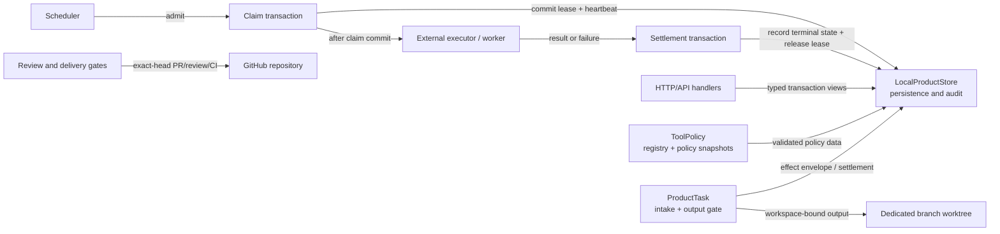

# Architecture

Current version: v38
Last updated: 2026-09-23.

This is the durable architecture, module ownership, and trust boundary specification for the Token-Efficient Agent Harness Lab. It consolidates system design, module ownership, single persistence authority, and trust boundaries into one authoritative document.

## System Mission

The system is a local and deterministic agent harness and workflow control plane for autonomous product development and repository maintenance. It provides:
- Rust `engine/` as the sole runtime, scheduler, policy, and application-owned storage authority.
- `LocalProductStore` as the sole persistence and audit owner across SQLite and PostgreSQL backends.
- Repository maintenance starts at `START_HERE.md`; the user's request or the
  next unblocked roadmap item supplies the work objective.
- Exact-head review, canonical CI, and the guarded GitHub merge workflow
  protect repository delivery without a parallel task-orchestration service.

### Core Objective

> Under non-negotiable quality, safety, traceability, compatibility, and rollback constraints, continuously increase verifiable and reusable task delivery per unit of total lifecycle cost.

Lower token consumption is an optimization, not a reason to weaken verification, safety, audit, or recovery guarantees.

## Authority Layers

The repository separates development governance from the product runtime and
from research decisions. Each authority has one owner:

| Layer | Canonical owner | Owns | Explicitly does not own |
|---|---|---|---|
| Repository development governance | `START_HERE.md`, `AGENTS.md`, `docs/AUTONOMY.md`, `.github/workflows/agent-merge.yml` | Direct user-requested development, verification, exact-head review, canonical CI, and guarded repository delivery | Product runtime, provider effects, deployment, release, protected `main` mutation, review/CI bypass, or merge outside the guarded workflow |
| Product and task runtime | Rust `engine/` | Execution, leases, scheduling, policy, task state, verification, output, effects, recovery, and rollback through its existing module owners | Repository-maintenance lifecycle, experimental adoption, or persistence outside the Store |
| Persistence and audit | `engine/src/storage/local_product_store/` | SQLite/PostgreSQL persistence, audit, idempotency, evidence/artifacts, effect envelopes, and terminal settlement | Runtime scheduling, research evaluation, or a second truth store |
| Common RWE measurement | `engine/src/rwe/` | Frozen task/corpus/protocol/schedule identity, comparable budgets, lifecycle evidence, missingness, and provider-free/live evidence seams | A shortcut around correctness, safety, comparability, Store persistence, or effect authority |
| Harness-Evolution evaluation | `engine/src/harness_evolution_eval.rs` | Sealed holdout, evaluator binding, hard gates, candidate/causal/Pareto evidence, and explicit `INCOMPARABLE` outcomes | Active-Harness replacement, merge, release, deployment, or adoption |
| Experimental descriptors and candidates | `engine/src/harness_evolution.rs`, `engine/src/harness_evolution/ledger_orchestration.rs` | Immutable Harness, Model, and Strategy descriptors, candidate Harness implementations (e.g. `ledger-orchestrated:provider-independent:v1`), matrix identity, adapter normalization, and explicit `INCOMPARABLE` projections | Runtime scheduling, budget/effect authority, evaluator mutation, or adoption |
| Adoption decision | User through explicit owner authority | Evidence-backed transfer/replication review and explicit adoption of a new Harness identity | Merge, release, deployment, evaluator replacement, or self-authorized active-Harness change |

RWE is therefore a shared measurement substrate, not a peer runtime or a
separate research authority. Context Working Set, memory, and skill mechanisms
are model-visible Strategy inputs when registered for an experiment; they do
not become truth, memory ownership, scheduling, evaluation, or approval merely
because they reduce context.

### Product-managed Codex boundary

Product-managed Codex execution remains owned by the Rust engine, its
`CodexBudgetGateway`, and `LocalProductStore`; repository-development tools do
not own provider identity, credentials, budgets, or effects. When enabled, the
launcher uses bubblewrap network isolation, a private ephemeral Unix socket,
and a TCP-to-Unix adapter bound to the authoritative gateway. Construction
fails before child spawn if isolation, the adapter, socket privacy, or the
exact gateway binding cannot be proved. The relay lives for the child process
and is cancelled and joined before socket cleanup. Process and gateway timeout
owners remain authoritative; network confinement alone does not prove retry
identity or full provider admission.

### Optional repository-safety hooks

`scripts/agent-control/codex_hooks/` provides optional `PreToolUse` and
`PermissionRequest` checks. It discovers the actual Git checkout, protects
`.git` and `.github`, and rejects dangerous or unprovable commands. It does
not inject session context, assign work, verify completion, intercept Stop,
or write a durable journal. Hooks are an optional safety adapter, not the
repository entrypoint or a prerequisite for development.

## Research Mainline: Finite Frozen Canonical Experiments

Research evidence on the common RWE basis is obtained only through finite
frozen canonical experiments, never through live or ad-hoc comparison runs.
Every experiment binds, before any run, a frozen task/corpus identity, an
exact evaluator binding, immutable Harness, Model, and Strategy descriptors, a
deterministic schedule, comparable budgets and identities, a protocol and
seeds, and a lifecycle analysis with explicit results and missingness. The
experiment mainline never grants effect, spend, merge, release, deployment,
evaluator, or adoption authority by itself; a separate finite authorization is
required for any live effect.

| Component | Canonical owner | Owns | Explicitly does not own |
|---|---|---|---|
| Common evidence substrate | `engine/src/rwe/` | Frozen task/corpus/schedule identity, budgets, protocol seeds, lifecycle evidence, and missingness | Provider spend, live-effect authority, or a second evaluator |
| Experimental descriptors and candidates | `engine/src/harness_evolution.rs`, `engine/src/harness_evolution/ledger_orchestration.rs` | Immutable Harness, Model, and Strategy descriptors, candidate Harness implementations (e.g. `ledger-orchestrated:provider-independent:v1`), matrix identity, adapter normalization, and explicit `INCOMPARABLE` projections | Runtime scheduling, budget/effect authority, evaluator mutation, or adoption |
| Evaluation and disposition | `engine/src/harness_evolution_eval.rs` | Sealed holdout, evaluator binding, hard gates, candidate/causal/Pareto evidence, and explicit `INCOMPARABLE` outcomes | Active-Harness replacement, merge, release, deployment, or adoption |
| Persistence and audit | `engine/src/storage/local_product_store/` | Experiment evidence/artifacts, budgets, and terminal settlement receipts | Research evaluation or a second truth store |
| Adoption decision | User through explicit owner authority | Evidence-backed transfer/replication review and explicit adoption of a new Harness identity | Merge, release, deployment, evaluator replacement, or self-authorized change |

Level-1 evidence and disposition (transfer, replication, and memory+skill) and
Level-2/Meta gates (R4/R5/R6) require complete lower-rung evidence, hard
quality/safety/comparability gates, and explicit authorized adoption before any
change to the active Harness. The research milestone gates are owned by
`docs/ROADMAP.md`; autonomy, testing, review, and merge rules by
`docs/AUTONOMY.md`.

The Luna-only Codex ladder uses two immutable campaign identities. The
`rwe-campaign-codex-luna-xhigh-v2` package binds the four actual cells produced
by the full frozen schedule at `1x1x1`; the
`rwe-campaign-codex-luna-xhigh-strategy-v3` package binds the same schedule
expanded across the three existing Strategies at `1x1x3` (twelve cells).
Store authorization derives each finite run-level request/token/time envelope
from the package-owned Matrix expansion factor and the unchanged schedule cell
sums. This keeps the original two-model package bytes unchanged while binding
its factor to two; the Luna packages bind factors one and three. A baseline
authorization therefore cannot select the extension rung, while historical
packages and evidence retain their original bytes and identities.
Before any live readiness probe, each runner maps its rung to one exact package
ID and requires the driver package to equal the canonical resolved package in
every field. The generic schedule accepts only its canonical DeepSeek package;
Codex packages cannot fall through to a four-cell generic run.

Managed Codex launch evidence distinguishes refusal before Store admission
from `store_lease_consumed_before_child`. The latter proves no process/provider
effect began but also proves the one-use Store attempt was consumed, so the
scheduler treats it as structurally terminal and never retries it. A failure
to terminalize after an actual process preserves that process and usage
evidence and is also non-retryable; it is not rewritten as a no-process claim.

### Research binding consolidation: compatibility plan

The following is a proposed follow-up design, not an alternate admission path
or a change to any existing frozen contract. Execution continuation is owned
by `AUTONOMY.md`; command procedures are owned by `RUNBOOK.md`.

- Derive provider/model/reasoning identity once from `FrozenCampaignPackage`
  and `FrozenProviderExecutionBinding`, then resolve the existing immutable
  Matrix descriptors. Consumers in the live coordinator, delegated manifest,
  and Store admission compare those identities rather than selecting their
  own role defaults. Preserve old package IDs and descriptor hashes; changed
  identities require a distinct freeze, not a migration of historical rows.
- Keep `draft_pr` in existing prerequisite and terminal validators. General
  output-mode support would require a separately versioned package contract
  consumed by ProductTask intake, delegated artifact confirmation, target
  output, and RWE prerequisite validation together. An `artifact_only`
  package must prove artifact/verifier/approval completeness without claiming
  a PR receipt. Legacy consumers retain their original Draft PR requirement.
- Separate provider-independent identity validation from live admission
  inside existing owners. A provider-free fixture can validate composition
  in CI, but cannot acquire live authority or seal external scientific
  evidence. Live admission still checks current lease, revocation, executor,
  binary, workspace, credential confinement, and finite spend at dispatch.
- Consolidate recoverable preflight findings and their existing-owner next
  actions in the coordinator; do not introduce a second approval or budget
  service. A preflight success is not a reusable spawn permit: mutable facts
  are rechecked immediately before the effect to prevent TOCTOU races.

Acceptance for that follow-up requires old-freeze replay compatibility,
SQLite/PostgreSQL parity, output-mode mismatch rejection, wrong-model and
stale-lease negative tests, CI/live separation, and restart tests proving no
duplicate effects. Retain the prior versioned readers and evidence so rollback
does not rewrite completed experiments. None of these proposed broader
changes is a prerequisite for running the currently authorized freeze.

## Repository Development and Delivery

The repository-development path is intentionally direct:

```mermaid
flowchart LR
    U["User request or next roadmap priority"] --> S["START_HERE.md"]
    S --> I["Inspect source, docs, tests, and Git state"]
    I --> C["Implement one coherent change"]
    C --> V["Run focused and required verification"]
    V --> R["Independent exact-head review"]
    R --> Q["Canonical CI and guarded GitHub merge"]
    Q --> N["Read back accepted main; select next work"]
```

`docs/AUTONOMY.md` owns the detailed verification, review, CI, merge, and
recovery contract. Generated context and local status projections are
informational only and never choose work or grant authority.

## Development Ownership

| Layer | Responsibility | Authority / Decision Maker |
|---|---|---|
| **Work objective** | User request or next unblocked product/maintenance roadmap item | User direction and repository evidence |
| **Change** | One coherent implementation with relevant tests and documentation | Implementing agent, reviewed against the exact diff |
| **Delivery** | Exact-head review, canonical CI, guarded merge, and accepted-main readback | Repository review and GitHub branch protection |

## Core Module Ownership

| Area | Canonical Owner | Boundary and Invariants |
|---|---|---|
| **Repository Navigation and Context** | `START_HERE.md`, `scripts/project_context.py`, `scripts/check_agent_handoff.py` | Direct repo entry and optional read-only status projection; generated context is not work selection or authority. |
| **API and Composition Root** | `engine/src/main.rs`, `engine/src/http_server/` | Sole startup and composition surface; frozen acyclic dependency topology and strict runtime mode gates. |
| **Workflow Runtime and Scheduler** | `engine/src/workflow/`, `engine/src/scheduler.rs`, `engine/src/scheduler/`, `engine/src/executor_pool.rs`, `engine/src/node_executor.rs` | Sole persisted workflow run, node, lease, retry, pause/kill, and concurrency executor. |
| **Persistence and Audit Store** | `engine/src/storage/local_product_store/` and PostgreSQL backend | Sole SQLite/PostgreSQL transaction, migration, audit, idempotency, evidence, and rollback owner. |
| **Managed-Acceptance and Effect Authority** | `engine/src/storage/local_product_store/managed_acceptance.rs`, `rwe_authority.rs` | Single persistent effect owner; parent effect envelopes, one-use child authorization derivation, spend ledger, terminal settlement, and non-retryable `OUTCOME_UNKNOWN`. |
| **Queue Lease Management** | `engine/src/storage/local_product_store/workflow_runs/queue_lease.rs` | Claim/execute/settle separation; lease transactions commit before external node execution and settle in discrete subsequent transactions. |
| **Workspace and Target Repository Output** | `engine/src/target_repo_output.rs`, `engine/src/storage/local_product_store/product_tasks.rs` | Target default branch is never a workspace; mutations occur in dedicated branch worktrees; patch export requires approved gates. |
| **Review and Repository Delivery** | `scripts/agent-control/review_convergence.py`, `scripts/agent-control/review_loop/`, `scripts/agent-control/validate_review.py`, `.github/workflows/agent-merge.yml` | R1/R2 independent exact-head review and guarded GitHub delivery; exact `PASS` is review evidence, while branch protection and the merge workflow retain delivery authority. These mechanisms do not select or schedule repository work. |
| **Wire Contracts and Codegen** | `wire_contract/`, `codegen/`, `engine/src/wire_types.rs` | Canonical schema definitions and deterministic cross-language codegen for Rust, TypeScript, and Python SDKs. |
| **Event Schema and Evidence** | `engine/src/event_schema.rs`, `docs/stage0/events.jsonl` | Canonical event schema validation, idempotency hashing, and Stage-0 event integrity. |
| **Investigation Escalation (`ask_sol`)** | `scripts/ask_sol.py`, `scripts/ask_sol`, `tests/test_ask_sol.py` | Bounded read-only investigation escalation; pre/post worktree dirty state non-mutation verification; per-state consultation budget. |

## Managed Effect and Single Ownership Invariant

The system enforces a strict single-owner rule for all external effects:
1. **Single Persistent Owner**: All effect envelopes, child authorizations, spend ledgers, and terminal settlement receipts are owned exclusively by `LocalProductStore` in Rust `engine/`.
2. **Immutable Parent Envelopes**: Parent effect envelopes bind owner-approved goal, total budget, finite expiration, and target destination.
3. **Bounded Child Authorizations**: One-use child authorizations are derived from a live parent envelope and cannot exceed parent budget, expiration, or target bounds.
4. **No Scope Leakage**: Effect authorizations remain bound to their immutable target, budget, and expiry; repository work does not grant product-effect authority.
5. **No Outcome-Unknown Retries**: Any effect resulting in `OUTCOME_UNKNOWN` is immediately terminalized as non-retryable and halted fail-closed.

## Lease Lifecycle Separation

Lease management strictly separates claim, execution, and settlement:
- **Claim**: An atomic DB transaction claims the queue lease and records initial lease heartbeat.
- **Execute**: The external worker/task executes outside any open database transaction.
- **Settle**: On completion or failure, a separate DB transaction records the terminal settlement and releases the lease.

## Target Repository Isolation

Target repository output operations strictly disallow operating directly on the default branch:
- Work is staged and validated in dedicated detached worktrees on isolated feature branches (`agent/*` or `acp/*`).
- Default branch push is prohibited; changes are exported as patches or Draft PRs requiring explicit verification.

## Final Change Impact Map

The product-runtime map keeps five owners explicit; repository development
uses its separate review and GitHub delivery boundary. Calls cross product
boundaries through typed APIs or bounded adapters; ownership does not move
with the call.

| Owner | Canonical calls and dependencies | Downstream impact | Acceptance invariant and evidence |
|---|---|---|---|
| **Store** | `LocalProductStore::with_transaction` and domain views under `engine/src/storage/local_product_store/` | SQLite/PostgreSQL persistence, audit, idempotency, effects, ProductTask state | One persistent owner for effects and receipts; `managed_acceptance` and PostgreSQL parity tests |
| **Scheduler** | `workflow_runs` uses `queue_lease` for claim, calls the external executor, then records settlement | Admission, concurrency, leases, retries, pause/kill, and run state | Claim transaction commits before external execution; settlement is a later transaction; scheduler/store tests |
| **ToolPolicy** | `tool_execution_policy`, `tool_registry`, and authenticated policy handlers | Capability, allowlist, hook validation, and execution gating | Policy mutations are hash-bound and audited by Store; tool registry and API policy tests |
| **ProductTask** | `product_tasks` transaction view, product-task handlers, and `target_repo_output` | Product intake, approval/output gates, workspace-bound patch export | Target default branch is never a workspace; target-output and golden-path recovery tests |

### PR7 Acceptance Scope

The final non-regression check is provider-free and read-only outside the
repository's normal test/build outputs. Its acceptance evidence is owned by
the canonical PR and CI/review records described in `docs/AUTONOMY.md`; this
architecture map records the boundaries under test and is explanatory only.

## Documentation Test

This document carries a bounded, self-contained documentation test. It passes
when every assertion below holds against this document and the code it
describes at the accepted head. An independent reviewer verifies the
assertions directly against the accepted document and code; the focused hygiene
gate is `git diff --check`. This section is documentation-only and grants no
new authority.

1. **Single runtime authority** — the document asserts Rust `engine/` is the
   sole runtime, scheduler, policy, and application-owned storage authority.
2. **Single persistence authority** — the document asserts `LocalProductStore`
   is the sole persistence and audit owner across SQLite and PostgreSQL
   backends.
3. **Development/runtime separation** — the document assigns repository
   navigation and delivery to repository documentation and GitHub workflows,
   while Rust `engine/` remains the sole product runtime and scheduler.
4. **Single-owner effect rule** — the document asserts all effect envelopes,
   child authorizations, spend ledgers, and terminal settlement receipts are
   owned exclusively by `LocalProductStore`.
5. **Schema version agreement** — the documented `Current version: vN` matches
   `CURRENT_SQLITE_SCHEMA_VERSION` in
   `engine/src/storage/local_product_store/schema.rs`.
6. **Link, do not duplicate** — the document references `docs/AUTONOMY.md` for
   autonomy, testing, review, and merge rules instead of restating them.
7. **Frozen-experiment gate** — the document asserts research evidence on the
   common RWE basis is obtained only through finite frozen canonical
   experiments whose corpus, evaluator, descriptors, schedule, budgets,
   identities, protocol seeds, lifecycle analysis, and results are frozen
   before any run, and that the experiment mainline grants no effect, spend,
   merge, release, deployment, evaluator, or adoption authority by itself.
8. **Level-1/Level-2/Meta gates** — the document asserts Level-1
   (transfer/replication/memory+skill) and Level-2/Meta (R4/R5/R6) disposition
   require complete lower-rung evidence, hard gates, and explicit authorized
   adoption before any change to the active Harness.

Assertions 1-8 are bounded to this document and hold at the accepted head; the
change is documentation-only and adds no new authority.
