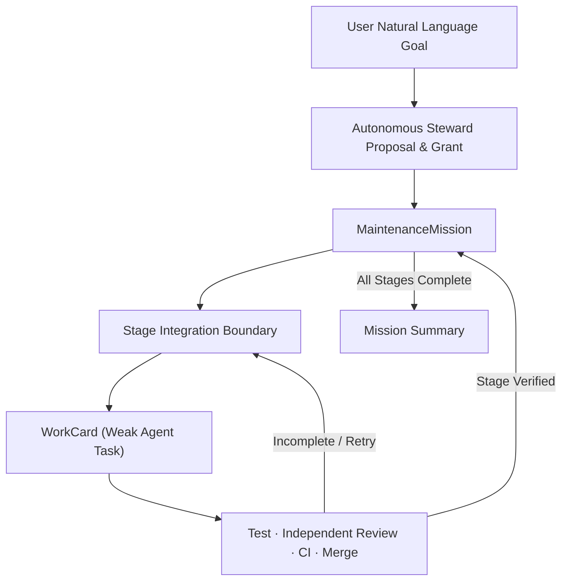
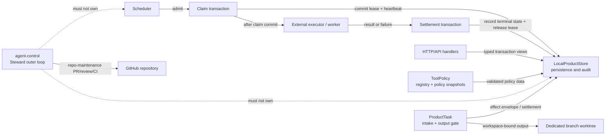

# Architecture

Current version: v38
Last updated: 2026-09-01.

This is the durable architecture, module ownership, and trust boundary specification for the Token-Efficient Agent Harness Lab. It consolidates system design, module ownership, single persistence authority, and trust boundaries into one authoritative document.

## System Mission

The system is a local and deterministic agent harness and workflow control plane for auditable coding-agent workflows. It provides:
- Rust `engine/` as the sole runtime, scheduler, policy, and application-owned storage authority.
- `LocalProductStore` as the sole persistence and audit owner across SQLite and PostgreSQL backends.
- Autonomous Steward as the repository-maintenance outer loop coordinating missions, stages, and workcards without creating parallel schedulers or state stores.

### Core Objective

> Under non-negotiable quality, safety, traceability, compatibility, and rollback constraints, continuously increase verifiable and reusable task delivery per unit of total lifecycle cost.

Lower token consumption is an optimization, not a reason to weaken verification, safety, audit, or recovery guarantees.

## Authority Layers

The repository separates maintenance automation from the product runtime and
from research decisions. Each authority has one owner:

| Layer | Canonical owner | Owns | Explicitly does not own |
|---|---|---|---|
| Repository-maintenance control plane | `scripts/agent-control/steward_service.py` | User-approved Missions, Steward Stages, bounded WorkCards, repository PR/review/CI/merge progression, and accepted-main readback | Product runtime, product scheduler, ProductStore, evaluator, research claims, Provider spend, or active-Harness replacement |
| Product and task runtime | Rust `engine/` | Execution, leases, scheduling, policy, task state, verification, output, effects, recovery, and rollback through its existing module owners | Repository-maintenance lifecycle, experimental adoption, or persistence outside the Store |
| Persistence and audit | `engine/src/storage/local_product_store/` | SQLite/PostgreSQL persistence, audit, idempotency, evidence/artifacts, effect envelopes, and terminal settlement | Runtime scheduling, research evaluation, or a second truth store |
| Common RWE measurement | `engine/src/rwe/` | Frozen task/corpus/protocol/schedule identity, comparable budgets, lifecycle evidence, missingness, and provider-free/live evidence seams | A shortcut around correctness, safety, comparability, Store persistence, or effect authority |
| Harness-Evolution evaluation | `engine/src/harness_evolution_eval.rs` | Sealed holdout, evaluator binding, hard gates, candidate/causal/Pareto evidence, and explicit `INCOMPARABLE` outcomes | Active-Harness replacement, merge, release, deployment, or adoption |
| Experimental descriptors | `engine/src/harness_evolution.rs` | Immutable Harness, Model, and Strategy descriptors, matrix identity, adapter normalization, and explicit `INCOMPARABLE` projections | Runtime scheduling, budget/effect authority, evaluator mutation, or adoption |
| Adoption decision | User through an owner-approved Mission/Stage decision | Evidence-backed transfer/replication review and explicit adoption of a new Harness identity | Merge, release, deployment, evaluator replacement, or self-authorized active-Harness change |

RWE is therefore a shared measurement substrate, not a peer runtime or a
separate research authority. Context Working Set, memory, and skill mechanisms
are model-visible Strategy inputs when registered for an experiment; they do
not become truth, memory ownership, scheduling, evaluation, or approval merely
because they reduce context.

## Research Mainline: Finite Frozen Canonical Experiments

Research evidence on the common RWE basis is obtained only through finite
frozen canonical experiments, never through live or ad-hoc comparison runs.
Every experiment binds, before any run, a frozen task/corpus identity, an
exact evaluator binding, immutable Harness, Model, and Strategy descriptors, a
deterministic schedule, comparable budgets and identities, a protocol and
seeds, and a lifecycle analysis with explicit results and missingness. The
experiment mainline never grants effect, spend, merge, release, deployment,
evaluator, or adoption authority by itself; a separate finite authorization is
required for any live effect.

| Component | Canonical owner | Owns | Explicitly does not own |
|---|---|---|---|
| Common evidence substrate | `engine/src/rwe/` | Frozen task/corpus/schedule identity, budgets, protocol seeds, lifecycle evidence, and missingness | Provider spend, live-effect authority, or a second evaluator |
| Experimental descriptors | `engine/src/harness_evolution.rs` | Immutable Harness, Model, and Strategy descriptors, matrix identity, adapter normalization, and explicit `INCOMPARABLE` projections | Runtime scheduling, budget/effect authority, evaluator mutation, or adoption |
| Evaluation and disposition | `engine/src/harness_evolution_eval.rs` | Sealed holdout, evaluator binding, hard gates, candidate/causal/Pareto evidence, and explicit `INCOMPARABLE` outcomes | Active-Harness replacement, merge, release, deployment, or adoption |
| Persistence and audit | `engine/src/storage/local_product_store/` | Experiment evidence/artifacts, budgets, and terminal settlement receipts | Research evaluation or a second truth store |
| Adoption decision | User through an owner-approved Mission/Stage decision | Evidence-backed transfer/replication review and explicit adoption of a new Harness identity | Merge, release, deployment, evaluator replacement, or self-authorized change |

Level-1 evidence and disposition (transfer, replication, and memory+skill) and
Level-2/Meta gates (R4/R5/R6) require complete lower-rung evidence, hard
quality/safety/comparability gates, and explicit authorized adoption before any
change to the active Harness. The research milestone gates are owned by
`docs/ROADMAP.md`; autonomy, testing, review, and merge rules by
`docs/AUTONOMY.md`.

## Three-Tier Operational Model

| Layer | Responsibility | Authority / Decision Maker |
|---|---|---|
| **Mission** | High-level objective, boundary, budget, standing grants, and acceptance criteria | User approves once; Steward executes |
| **Stage** | Discrete, verifiable integration milestone and PR boundary | Autonomous Steward |
| **WorkCard** | Fine-grained, isolated task with exact paths, steps, tests, and evidence | Autonomous Steward schedules; Weak Agent executes |

## Core Module Ownership

| Area | Canonical Owner | Boundary and Invariants |
|---|---|---|
| **Repository Navigation and Context** | `START_HERE.md`, `scripts/project_context.py`, `scripts/session_context.py`, `scripts/check_agent_handoff.py` | Role-based reading routes and on-demand context projection; session checkpoints are local Git-private digests, never parallel authority stores. |
| **API and Composition Root** | `engine/src/main.rs`, `engine/src/http_server/` | Sole startup and composition surface; frozen acyclic dependency topology and strict runtime mode gates. |
| **Workflow Runtime and Scheduler** | `engine/src/workflow/`, `engine/src/scheduler.rs`, `engine/src/scheduler/`, `engine/src/executor_pool.rs`, `engine/src/node_executor.rs` | Sole persisted workflow run, node, lease, retry, pause/kill, and concurrency executor. |
| **Persistence and Audit Store** | `engine/src/storage/local_product_store/` and PostgreSQL backend | Sole SQLite/PostgreSQL transaction, migration, audit, idempotency, evidence, and rollback owner. |
| **Managed-Acceptance and Effect Authority** | `engine/src/storage/local_product_store/managed_acceptance.rs`, `rwe_authority.rs` | Single persistent effect owner; parent effect envelopes, one-use child authorization derivation, spend ledger, terminal settlement, and non-retryable `OUTCOME_UNKNOWN`. |
| **Queue Lease Management** | `engine/src/storage/local_product_store/workflow_runs/queue_lease.rs` | Claim/execute/settle separation; lease transactions commit before external node execution and settle in discrete subsequent transactions. |
| **Workspace and Target Repository Output** | `engine/src/target_repo_output.rs`, `engine/src/storage/local_product_store/product_tasks.rs` | Target default branch is never a workspace; mutations occur in dedicated branch worktrees; patch export requires approved gates. |
| **Autonomous Steward Outer Loop** | `scripts/agent-control/steward_service.py`, `steward.py`, `steward_journal.py`, `steward_workers.py`, `steward_github.py`, `mission_contract.py` | `StewardService` is the sole journal-backed Mission lifecycle writer: authenticated approval, K=2 isolated dispatch, Draft/Ready/CI/review repair, canonical merge dispatch, and PR/head-bound accepted-main readback. `steward.py` is an execution seam only; neither intrudes on Rust ProductStore authority. |
| **Review Convergence Protocol** | `scripts/agent-control/review_convergence.py`, `scripts/agent-control/review_loop/`, `scripts/agent-control/validate_review.py` | R1/R2 substantive review budget; exact `PASS` is the sole merge-authorizing verdict; structured blocker vs deferred note classification. |
| **Wire Contracts and Codegen** | `wire_contract/`, `codegen/`, `engine/src/wire_types.rs` | Canonical schema definitions and deterministic cross-language codegen for Rust, TypeScript, and Python SDKs. |
| **Event Schema and Evidence** | `engine/src/event_schema.rs`, `docs/stage0/events.jsonl` | Canonical event schema validation, idempotency hashing, and Stage-0 event integrity. |
| **Investigation Escalation (`ask_sol`)** | `scripts/ask_sol.py`, `scripts/ask_sol`, `tests/test_ask_sol.py` | Bounded read-only investigation escalation; pre/post worktree dirty state non-mutation verification; per-state consultation budget. |

## Managed Effect and Single Ownership Invariant

The system enforces a strict single-owner rule for all external effects:
1. **Single Persistent Owner**: All effect envelopes, child authorizations, spend ledgers, and terminal settlement receipts are owned exclusively by `LocalProductStore` in Rust `engine/`.
2. **Immutable Parent Envelopes**: Parent effect envelopes bind owner-approved goal, total budget, finite expiration, and target destination.
3. **Bounded Child Authorizations**: One-use child authorizations are derived from a live parent envelope and cannot exceed parent budget, expiration, or target bounds.
4. **No Cross-Stage Leakage**: Authority grants do not automatically transfer across stages. Unconsumed authorizations expire upon stage completion.
5. **No Outcome-Unknown Retries**: Any effect resulting in `OUTCOME_UNKNOWN` is immediately terminalized as non-retryable and halted fail-closed.

## Lease Lifecycle Separation

Lease management strictly separates claim, execution, and settlement:
- **Claim**: An atomic DB transaction claims the queue lease and records initial lease heartbeat.
- **Execute**: The external worker/task executes outside any open database transaction.
- **Settle**: On completion or failure, a separate DB transaction records the terminal settlement and releases the lease.

## Target Repository Isolation

Target repository output operations strictly disallow operating directly on the default branch:
- Work is staged and validated in dedicated detached worktrees on isolated feature branches (`agent/*` or `acp/*`).
- Default branch push is prohibited; changes are exported as patches or Draft PRs requiring explicit verification.

## Final Change Impact Map

The final migration boundary keeps five owners explicit. Calls cross these
boundaries through typed APIs or bounded adapters; ownership does not move with
the call.

| Owner | Canonical calls and dependencies | Downstream impact | Acceptance invariant and evidence |
|---|---|---|---|
| **Store** | `LocalProductStore::with_transaction` and domain views under `engine/src/storage/local_product_store/` | SQLite/PostgreSQL persistence, audit, idempotency, effects, ProductTask state | One persistent owner for effects and receipts; `managed_acceptance` and PostgreSQL parity tests |
| **Scheduler** | `workflow_runs` uses `queue_lease` for claim, calls the external executor, then records settlement | Admission, concurrency, leases, retries, pause/kill, and run state | Claim transaction commits before external execution; settlement is a later transaction; scheduler/store tests |
| **ToolPolicy** | `tool_execution_policy`, `tool_registry`, and authenticated policy handlers | Capability, allowlist, hook validation, and execution gating | Policy mutations are hash-bound and audited by Store; tool registry and API policy tests |
| **ProductTask** | `product_tasks` transaction view, product-task handlers, and `target_repo_output` | Product intake, approval/output gates, workspace-bound patch export | Target default branch is never a workspace; target-output and golden-path recovery tests |
| **agent-control** | `steward_service.py`, `steward.py`, `steward_journal.py`, `steward_workers.py`, `steward_github.py`, `mission_contract.py` | Repository-maintenance missions, stages, WorkCards, reviews, PR integration, and guarded merge dispatch | One journal-backed lifecycle writer; authenticated Issue-comment approval; OpenCode worker/reviewer transport; GitHub remains merge and accepted-main authority; no ProductStore runtime state |

### PR7 Acceptance Scope

The final non-regression check is provider-free and read-only outside the
repository's normal test/build outputs. Its acceptance evidence is owned by
the canonical PR and CI/review records described in `docs/AUTONOMY.md`; this
architecture map records the boundaries under test and is explanatory only.

## Documentation Test

This document carries a bounded, self-contained documentation test. It passes
when every assertion below holds against this document and the code it
describes at the accepted head. An independent reviewer verifies the
assertions directly against the accepted document and code; the focused hygiene
gate is `git diff --check`. This section is documentation-only and grants no
new authority.

1. **Single runtime authority** — the document asserts Rust `engine/` is the
   sole runtime, scheduler, policy, and application-owned storage authority.
2. **Single persistence authority** — the document asserts `LocalProductStore`
   is the sole persistence and audit owner across SQLite and PostgreSQL
   backends.
3. **Outer-loop non-ownership** — the document asserts the Autonomous Steward
   is a repository-maintenance outer loop that must not own the Store or the
   Scheduler.
4. **Single-owner effect rule** — the document asserts all effect envelopes,
   child authorizations, spend ledgers, and terminal settlement receipts are
   owned exclusively by `LocalProductStore`.
5. **Schema version agreement** — the documented `Current version: vN` matches
   `CURRENT_SQLITE_SCHEMA_VERSION` in
   `engine/src/storage/local_product_store/schema.rs`.
6. **Link, do not duplicate** — the document references `docs/AUTONOMY.md` for
   autonomy, testing, review, and merge rules instead of restating them.
7. **Frozen-experiment gate** — the document asserts research evidence on the
   common RWE basis is obtained only through finite frozen canonical
   experiments whose corpus, evaluator, descriptors, schedule, budgets,
   identities, protocol seeds, lifecycle analysis, and results are frozen
   before any run, and that the experiment mainline grants no effect, spend,
   merge, release, deployment, evaluator, or adoption authority by itself.
8. **Level-1/Level-2/Meta gates** — the document asserts Level-1
   (transfer/replication/memory+skill) and Level-2/Meta (R4/R5/R6) disposition
   require complete lower-rung evidence, hard gates, and explicit authorized
   adoption before any change to the active Harness.

Assertions 1-8 are bounded to this document and hold at the accepted head; the
change is documentation-only and adds no new authority.
