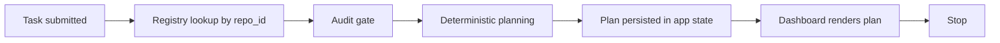

# Harness App MVP3 Deterministic Planning Kernel

MVP3 adds a deterministic planning kernel to the local Harness app. It turns a
registered repository, a task objective, risk hints, token budgets, and the
read-only audit result into a non-executable resource plan.

This is still not an autonomous agent runtime. MVP3 does not call model
providers, start sandboxes, dispatch workers, run commands, approve work, mutate
target repositories, or deploy anything.

## Scope

- `POST /api/plans` accepts `repo_id`, objective, task type, risk level, and
  token budgets.
- `GET /api/plans/<plan_id>` returns stored planning state.
- Plan state is app-owned and stored as plans JSON using schema `app_plans.v1`.
- The default plan store is outside the repository, under the user's local app
  state directory.
- Every plan includes `executable=false`.
- Plans use only these statuses:
  - `ready_for_review`
  - `needs_approval`
  - `blocked`

`ready_for_review` means the plan is suitable for human review. It is not
approval, execution authorization, or permission to mutate a target repository.
Any role names in planned steps, including `executor`, are planned roles only;
MVP3 does not activate workers or perform those actions.

## Planning Flow



Remote repositories are metadata-only and produce a blocked plan with
`remote_metadata_only`. Local repositories must pass through the read-only audit
gate before planning. If the audit verdict is `BLOCKED`, the plan is blocked.

## Risk Rule

The user-provided `risk_level` is treated as an input hint, not authority. The
planner computes an effective risk from:

- user risk level
- task type
- objective and constraint keywords
- audit verdict

High-risk keywords such as write, deploy, provider, sandbox, worker, MCP,
autonomous, and execution-related terms force approval gates. They never produce
an executable or self-approved plan.

## Token Budget Rule

The planner preserves these invariants:

- `max_context_tokens >= 0`
- `max_execution_tokens >= 0`
- `total_token_budget = context_budget + execution_budget`
- `sum(step.token_budget) <= total_token_budget`
- `context_budget <= max_context_tokens`
- `execution_budget <= max_execution_tokens`

When context tokens are tight, context mode degrades deterministically:

```text
full -> excerpt -> summary -> none
```

The plan records this in `token_efficiency_notes` so the dashboard can explain
why a lower-context strategy was selected.

## API Boundary

`POST /api/plans` accepts `repo_id` only. It rejects direct `path` input so the
planning API cannot become a filesystem escape hatch. The registry remains the
only source of repository references.

The API also rejects a plan store path located inside the selected local target
repository. Plan storage is app state only; target repositories remain read-only.

The dashboard can generate and display plans, but it has no run, approve,
provider, sandbox, worker, or deployment controls.
