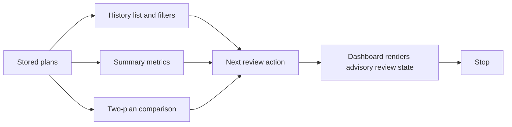

# Harness App MVP4 Plan Review Workbench

MVP4 adds a read-only plan review workbench on top of MVP3 deterministic
planning. It helps a user inspect stored plans, compare token budgets, and pick
the next review action without granting execution authority.

MVP4 is not a project manager, approval workflow, worker scheduler, sandbox, or
autonomous agent runtime.

## Scope

- Read stored app-owned plans from `app_plans.v1`.
- Derive lightweight plan history rows.
- Derive summary metrics across stored plans.
- Compare exactly two stored plans.
- Recommend a deterministic next review action.
- Render the derived views in the local dashboard.

MVP4 does not change the plan store schema and does not write target
repositories. All workbench APIs are read-only over existing app-owned plan
state.

## Flow

## APIs

`GET /api/plans`

Returns lightweight plan summaries. Supported filters:

- `repo_id`
- `status`
- `risk_level`
- `task_type`
- `limit`

`GET /api/plans/summary`

Returns counts by status and repo kind, total and average token budget, blocker
counts, approval-gate counts, and the most common next review action.

`GET /api/plans/compare?plan_id=a&plan_id=b`

Returns a deterministic two-plan comparison: status delta, review-action delta,
token budget deltas, step count delta, gate delta, blocker delta, context-mode
changes, and an efficiency note.

## Review Actions

Review actions are advisory only. They do not approve, execute, schedule,
dispatch, or mutate anything.

- `review_remote_limit`
- `review_audit_failure`
- `review_blockers`
- `review_approval_gates`
- `review_token_budget`
- `review_steps`
- `ready_for_human_decision`

`ready_for_review` still means ready for human review only. It is not approval
and not execution authorization.

## Boundaries

MVP4 does not add:

- model API calls
- provider credentials
- provider failover
- sandbox, process, container, or VM execution
- autonomous agents
- concurrent workers
- production deployment
- target repo writes
- plan status mutation
- approval, run, execute, dispatch, assign, merge, or deploy controls
