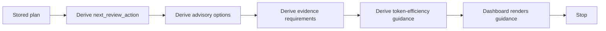

# Harness App MVP5 Review Guidance Preview

MVP5 adds non-persistent review guidance derived from stored non-executable
plans. It helps a human reviewer see advisory options, required evidence, and
token-efficiency guidance for one selected plan.

MVP5 is a preview surface only. It does not add approval records, execution,
workers, provider calls, sandboxing, target repository writes, or plan status
mutation.

## Scope

- Read one stored app-owned plan from `app_plans.v1`.
- Derive the next review action from the existing MVP4 workbench rules.
- Derive advisory review options for the selected plan.
- Derive evidence requirements for human inspection.
- Derive token-efficiency guidance from the stored plan budget and notes.
- Render the guidance in the local dashboard.

All MVP5 outputs are deterministic and derived at request time. The guidance is
not persisted.

## Flow

## API

`GET /api/plans/review-guidance?plan_id=<plan-id>`

Returns a derived `ReviewGuidance` object:

- `plan_id`
- `status`
- `executable=false`
- `preview_only=true`
- `next_review_action`
- `recommended_option`
- `options`
- `evidence_requirements`
- `token_efficiency_guidance`
- `boundary_notice`

Request errors are structured:

- Missing `plan_id`: `400 invalid_review_guidance_request`.
- Unknown `plan_id`: `404 plan_not_found`.
- Corrupt plan store: `500 plan_store_error`.

The endpoint is GET-only. It does not write the plan store or target
repository.

## Review Options

Review options describe human-review-only next steps. They do not approve,
run, schedule, dispatch, apply, merge, deploy, assign workers, or mutate plans.

- `continue_review`
- `request_more_context`
- `reduce_budget`
- `register_local_repo`
- `revise_objective`
- `split_plan`
- `inspect_blockers`
- `inspect_audit_result`
- `inspect_gates`
- `compare_with_lower_budget_plan`
- `keep_remote_metadata_only`

## Derivation Rules

- `blocked` with `remote_metadata_only`: suggest local registration or keeping
  remote metadata-only.
- `blocked` with an audit blocker: suggest inspecting the audit result.
- Other `blocked` plans: suggest inspecting blockers.
- `needs_approval`: suggest inspecting gates and continuing review; it does not
  record any gate outcome.
- `ready_for_review` with budget pressure: suggest reducing budget or comparing
  with a lower-budget plan.
- `ready_for_review` with many steps: suggest splitting the plan.
- Clean `ready_for_review`: suggest continuing review.

## Boundaries

MVP5 does not add:

- model API calls
- provider credentials
- provider failover
- sandbox, process, container, or VM execution
- autonomous agents
- concurrent workers
- production deployment
- target repo writes
- plan store writes from the guidance endpoint
- plan status mutation
- approval, run, execute, dispatch, assign, merge, or deploy controls
