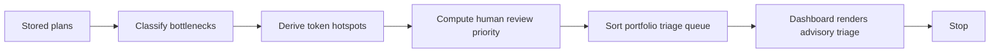

# Harness App MVP6 Planning Portfolio Triage

MVP6 adds a read-only portfolio triage view over stored non-executable plans.
It helps a human reviewer see which plans need attention first, where blockers
cluster, and where token budgets look inefficient.

MVP6 is not a scheduler, project manager, agent coordinator, or execution
queue. It derives review information from app-owned plan state and stops.

## Scope

- Read stored app-owned plans from `app_plans.v1`.
- Derive deterministic portfolio triage items.
- Rank plans by human review priority.
- Surface blocker, gate, remote-metadata, audit, and token-budget bottlenecks.
- Surface token hotspots.
- Render portfolio triage in the local dashboard.

MVP6 does not persist triage output and does not change the plan store schema.

## Flow

## API

`GET /api/plans/triage`

Optional filters:

- `repo_id`
- `limit`

`limit` must be a positive integer less than or equal to `100`. Invalid limits
return `400 invalid_plan_triage_request`.

The response contains:

- `schema_version=plan_triage.v1`
- `repo_id`
- `total_plans`
- `returned_items`
- `generated_from_store_only=true`
- `persistent=false`
- `non_executable=true`
- `summary`
- `items`
- `boundary_notice`

The endpoint is GET-only and derived-only. It does not write the plan store or
target repositories.

## Triage Rules

Review priority is human review priority, not execution priority.

| Plan condition | Review bucket | Bottleneck | Review Priority |
| --- | --- | --- | --- |
| `blocked` with `remote_metadata_only` | `remote_limited` | `remote_metadata_only` | 70 |
| `blocked` with `audit_blocked` | `audit_blocked` | `audit_failure` | 90 |
| Other `blocked` plan | `blocked` | `blockers` | 85 |
| `needs_approval` | `review_gates` | `approval_gates` | 80 |
| `ready_for_review` with budget pressure | `token_budget_review` | `token_hotspot` | 60 |
| `ready_for_review` with many steps | `split_or_simplify` | `plan_complexity` | 50 |
| Clean `ready_for_review` | `normal_review` | `none` | 40 |

Sort order is deterministic:

1. `review_priority` descending.
2. Stored index descending.
3. `plan_id` ascending.

## Token Hotspots

MVP6 derives token hotspot labels:

- `high_context_budget`
- `budget_pressure_notes_present`
- `full_context_under_pressure`
- `high_step_count`
- `gate_heavy_plan`

These labels are advisory. They do not request more context, change budgets, or
modify plans.

## Dashboard

The dashboard adds a `Planning Portfolio Triage` panel with:

- `Refresh triage`
- repo filter
- summary metrics
- triage table
- selected item detail

Allowed action labels remain review-only:

- `Refresh triage`
- `View plan`
- `Generate review guidance`
- `Compare plans`

## Boundaries

MVP6 does not add:

- model API calls
- provider credentials
- provider failover
- sandbox, process, container, or VM execution
- autonomous agents
- concurrent workers
- production deployment
- target repo writes
- plan store writes from the triage endpoint
- plan status mutation
- approval, run, execute, dispatch, assign, start, apply, merge, launch, or deploy controls
- task assignment
- issue creation
