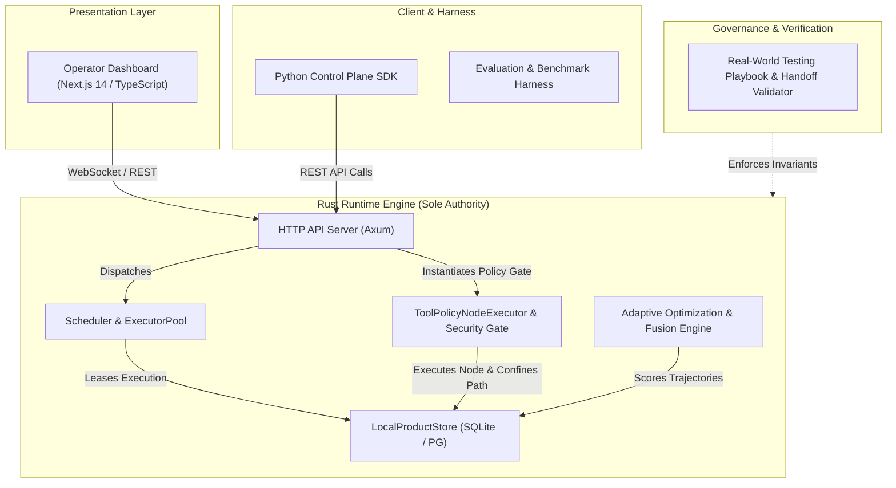

# Architecture Visual Showcase & System Mapping

This directory provides interactive, human-first visual architecture maps and runtime execution flow diagrams for the `token-efficient-agent-harness-lab` control plane, along with a practical **Change Impact Map** for engineers and autonomous agents.

---

## 1. Showcase Artifacts

| File | Language | Purpose & Content |
| :--- | :--- | :--- |
| [`architecture_cn.html`](./architecture_cn.html) | 中文 / Chinese | **全局架构拓扑交互图**：4 大核心子系统、各模块所有权、权威边界、代码行数与依赖连线 |
| [`architecture.html`](./architecture.html) | English | **Global Architecture Topology**: 4 subsystems, component authorities, LOC stats, and dependency contracts |
| [`runtime_sequence_cn.html`](./runtime_sequence_cn.html) | 中文 / Chinese | **运行时执行时序交互图**：7 个核心参与者从外部请求进入到 Leased 执行、状态回写及失败重试的完整链路 |
| [`runtime_sequence.html`](./runtime_sequence.html) | English | **Runtime Execution Sequence**: Chronological 7-participant tick flow with lease claims, policy gates, and recovery |
| [`architecture.json`](./architecture.json) | JSON Schema | 结构化架构拓扑数据源（节点、依赖、权威定义） |
| [`sequence.json`](./sequence.json) | JSON Schema | 结构化时序图数据源（参与者、消息、生命周期） |
| [`CHANGE_IMPACT_MAP.md`](./CHANGE_IMPACT_MAP.md) | 中英双语 | **核心模块变更影响与防御矩阵**：修改各核心模块时的爆炸半径、铁律、禁手反模式与必跑测试基线 |

---

## 2. Core Subsystems Overview



---

## 3. How to View

Open any of the `.html` files in your modern web browser:

```bash
# In your local browser or desktop environment:
xdg-open docs/architecture_showcase/architecture_cn.html
xdg-open docs/architecture_showcase/runtime_sequence_cn.html
```

Or serve the directory via any static HTTP server:

```bash
python3 -m http.server 8000 --directory docs/architecture_showcase
```

---

## 4. Development & Safety Guidelines

Before modifying any core component of the repository, always consult [`CHANGE_IMPACT_MAP.md`](./CHANGE_IMPACT_MAP.md) to inspect the blast radius, non-negotiable invariants, and mandatory test suites.
